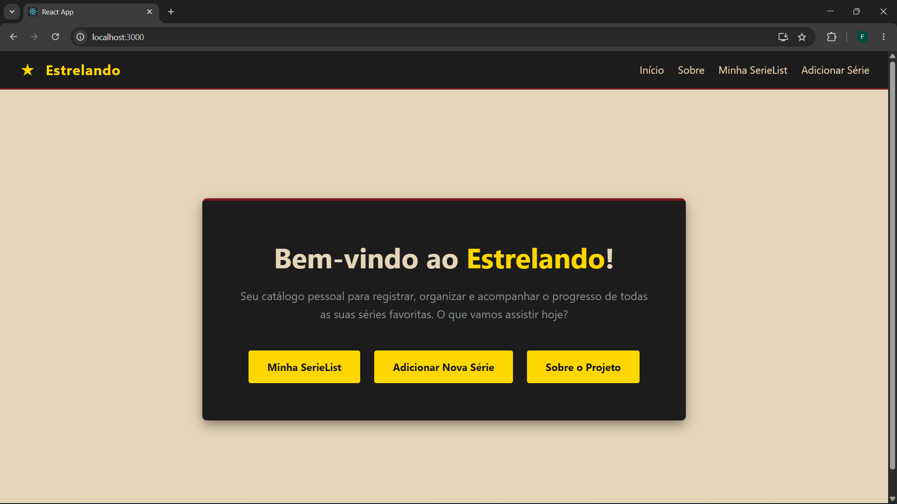
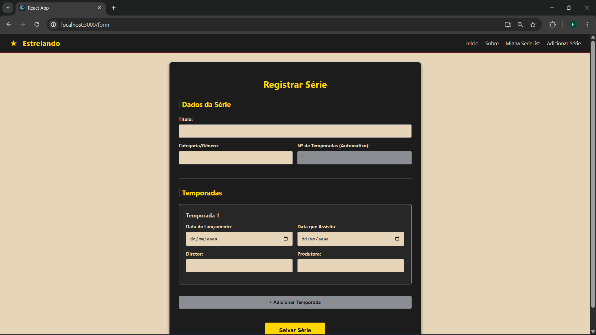
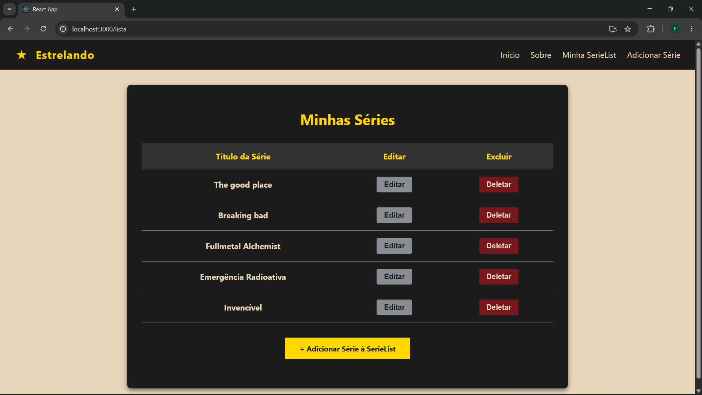
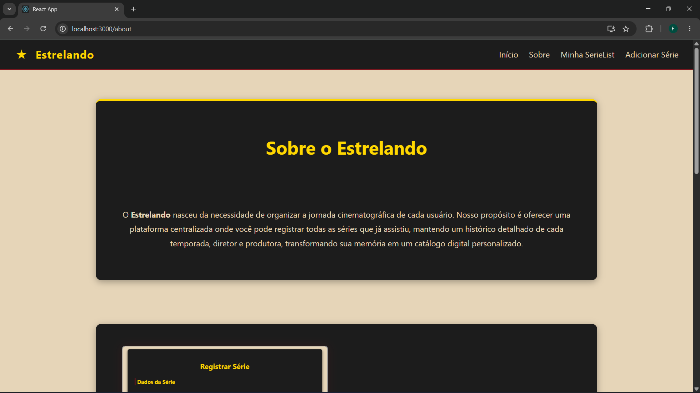

# 🎬 Estrelando

O **Estrelando** é uma aplicação web (Single Page Application) desenvolvida em React para o registro e organização de séries assistidas. O sistema permite que o usuário gerencie seu catálogo pessoal, adicionando detalhes sobre cada série, como categoria e um histórico dinâmico de temporadas com dados de direção, produtora e datas de visualização.

---

## 🎓 Identificação do Aluno

* **Nome:** Felix Pinheiro Lee
* **Curso:** Análise e Desenvolvimento de Sistemas
* **Instituição:** PUCRS (Pontifícia Universidade Católica do Rio Grande do Sul)
* **Disciplina:** Desenvolvimento de Sistemas frontend

---

## 🚀 Como Rodar a Aplicação

Para executar este projeto localmente na sua máquina, siga os passos abaixo. Você precisará ter o [Node.js](https://nodejs.org/) instalado.

1. **Abra o terminal** e navegue até a pasta raiz do projeto.
2. **Instale as dependências** do projeto (incluindo o `react-router-dom`) executando o comando:
    ```bash
    npm install
    ```
3. **Inicie o servidor de desenvolvimento** com o comando:
    ```bash
    npm start
    ```
4. A aplicação será aberta automaticamente no seu navegador padrão no endereço `http://localhost:3000`.

---

## 🧩 Descrição dos Componentes

A aplicação foi componentizada seguindo as melhores práticas do React, dividida nas seguintes estruturas principais:

* **`App` (Principal):** Responsável por abrigar o `BrowserRouter` e gerenciar as rotas (`Routes` e `Route`) da aplicação, definindo qual página deve ser renderizada de acordo com a URL.
* **`NavBar`:** Elemento de navegação global, renderizado no topo de todas as páginas. Fornece links instantâneos (`react-router-dom Link`) para a Home, Sobre, SerieList e Formulário.
* **`Home`:** Página de apresentação inicial. Contém uma mensagem de boas-vindas e atalhos rápidos (botões estilizados) para as principais ações do usuário (ver lista, adicionar série ou ler sobre o projeto).
* **`Sobre`:** Componente informativo que detalha o propósito da aplicação. Utiliza um layout alternado com imagens explicativas sobre o funcionamento do formulário e da lista de séries.
* **`SerieForm`:** O núcleo de entrada de dados. Gerencia estados complexos, permitindo registrar os dados gerais da série e adicionar/remover dinamicamente campos de temporadas (elementos filhos). Lida com as lógicas de criação e atualização, persistindo os dados no `localStorage`.
* **`SerieList`:** Interface de visualização do catálogo. Lê os dados salvos no `localStorage` e os renderiza em uma tabela. Fornece botões interativos para acessar a edição de uma série (reaproveitando o componente `SerieForm`) ou deletá-la (através de um modal de confirmação).

---

## 🛠️ Tecnologias Utilizadas

* **React (Create React App):** Biblioteca base para a construção das interfaces.
* **React Router Dom:** Gerenciamento das rotas internas sem recarregamento da página.
* **LocalStorage API:** Persistência de dados local diretamente no navegador do usuário.
* **CSS3:** Estilização desenvolvida do zero, utilizando Flexbox para responsividade e uma paleta de cores personalizada.

---

## 📸 Prints da Aplicação

*(Substitua os caminhos abaixo pelas imagens reais da sua aplicação rodando)*

### 1. Página Inicial (Home)

*Tela de boas-vindas com atalhos para as funcionalidades principais.*

### 2. Formulário de Registro (SerieForm)

*Interface de cadastro permitindo a adição dinâmica de múltiplas temporadas.*

### 3. Minha SerieList

*Tabela de gerenciamento das séries já cadastradas com opções de edição e exclusão.*

### 4. Sobre o Projeto

*Página descritiva demonstrando o propósito e o manual de uso da plataforma.*